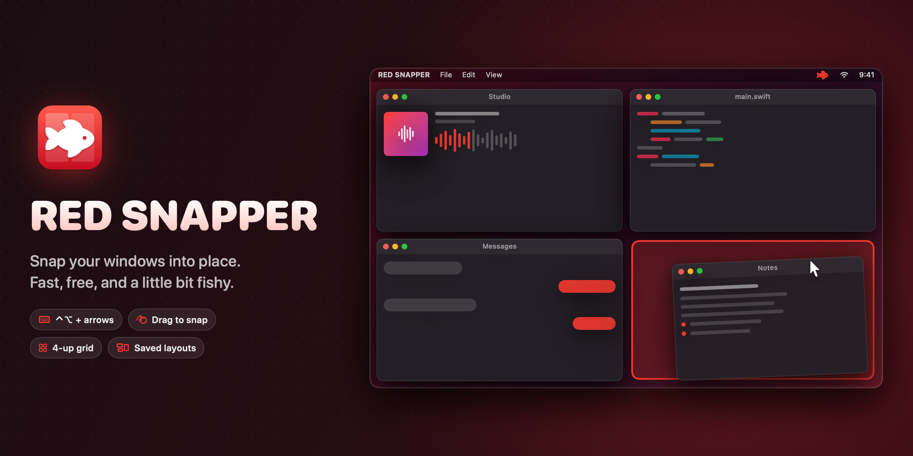
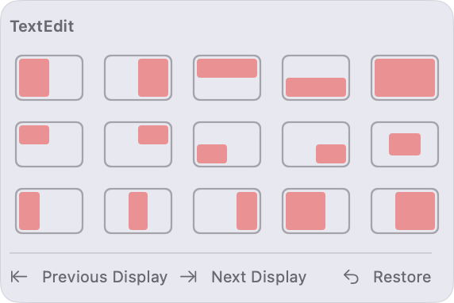
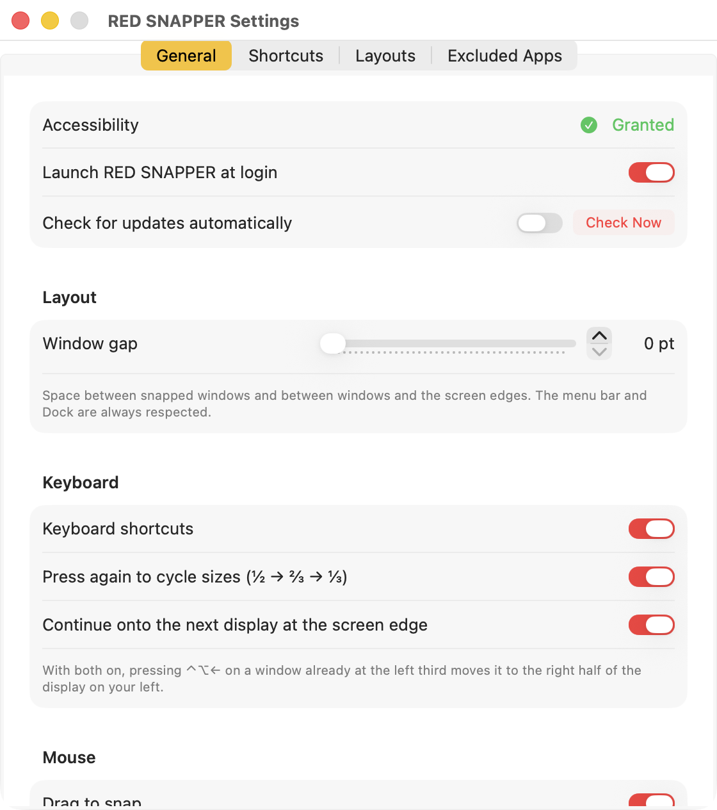

  

  <a href="https://github.com/cesarroger/red-snapper/releases/latest"><b>⬇︎ Download for Mac</b></a>
  &nbsp;·&nbsp; free &nbsp;·&nbsp; macOS 14 Sonoma or newer &nbsp;·&nbsp; Apple silicon & Intel

---

## Hi, I'm RED SNAPPER 🐟

You know that moment when you have a browser, a chat, your music session and some notes all piled on top of each other, and you spend more time dragging windows around than actually working?

RED SNAPPER fixes that. It's a tiny app that lives in your menu bar and snaps windows exactly where you want them, with one keystroke or a quick drag to the edge of the screen. No fiddling, no pixel-hunting, no "why is this window *slightly* overlapping that one."

It's free, it's open source, and it stays out of your way until you need it.

## What it can do

**⌨️ Snap with your keyboard.** Hold **Control + Option** and tap an arrow key. Boom: left half, right half, top, bottom. Tap the same arrow again and the window cycles from ½ to ⅔ to ⅓ of the screen. Keep going and it swims over to your other display.

**🖱️ Drag to snap.** Drag any window to a screen edge or corner and a red preview shows where it'll land. Let go and it's snapped. Drag it away again and it pops back to its old size.

**🔲 The 4-up grid.** Press **⌃⌥Q** and your four most recently used windows tile into a neat 2×2 grid. Perfect for "I need to see everything at once."

**🎯 Right-click to pick.** Right-click an empty spot in any window's title bar and pick a layout from a little menu. Great when you can't remember a shortcut.

**💾 Saved layouts.** Got a "making beats" setup and an "answering email" setup? Save each arrangement once, then bring it back with a single shortcut, across every display.

**↩️ Changed your mind?** **⌃⌥⌫** puts the window back exactly where it was before you snapped it.

**🖥️🖥️ Plays nice with multiple displays.** Send a window to your other screen with **⌃⌥⌘ + arrow**. It keeps its spot and its size.

  

## Shortcuts cheat sheet

Every shortcut starts with **⌃ Control + ⌥ Option**. You can change any of them in Settings.

| Press | To get | | Press | To get |
|:---:|---|---|:---:|---|
| **← →** | left / right half | | **U I J K** | the four corners |
| **↑ ↓** | top / bottom half | | **D F G** | left / middle / right third |
| **↩ Return** | full screen | | **C** | center it |
| **Q** | 4-up grid | | **⌫ Delete** | undo the snap |
| **⌘ + ← →** | move to the other display | | *same key again* | cycle the size (½ → ⅔ → ⅓) |

## Getting started

1. **[Download the latest release](https://github.com/cesarroger/red-snapper/releases/latest)** and unzip it.
2. Drag **RED SNAPPER** into your **Applications** folder and open it.
3. RED SNAPPER asks for **Accessibility** permission. Click *Open System Settings* and flip the switch next to RED SNAPPER.
4. Look for the little red fish 🐟 in your menu bar. That's it. Go snap something.

**Why does it need Accessibility?** That's the macOS permission that lets an app move and resize other apps' windows, which is the whole job. RED SNAPPER doesn't read what's *in* your windows, doesn't collect anything, and the only time it goes online is to check for updates.

## Make it yours

Open **Settings** from the fish menu to:

- remap any shortcut (click it, press new keys, done)
- add a little breathing room between windows with **window gap**
- tell RED SNAPPER to leave certain apps alone (games, full-screen tools…)
- start it automatically when you log in
- turn auto-updates on or off

  

## Little questions

**Is it really free?** Yep. No trial, no account, no ads. It's [MIT-licensed](LICENSE) open source.

**How does it update?** It checks for new versions now and then (you can switch that off), and every update is signed, so only real RED SNAPPER updates get installed.

**Why isn't it on the Mac App Store?** Apple requires App Store apps to run in a sandbox, and sandboxed apps aren't allowed to move other apps' windows. So, like most window managers, RED SNAPPER is a direct download. It's still signed and **notarized by Apple**, so your Mac will open it without any scary warnings.

**My Mac already snaps windows. Why would I want this?** macOS has basic tiling built in, and RED SNAPPER happily takes over when you drag. For the smoothest drags, switch off *System Settings → Desktop & Dock → "Drag windows to screen edges to tile"*. What you get on top: keyboard shortcuts for everything, thirds, cycling sizes, the 4-up grid, saved layouts and undo.

**Something's not working.** Please [open an issue](https://github.com/cesarroger/red-snapper/issues) and tell me what happened. Screenshots help a lot!

## For tinkerers

RED SNAPPER is written in Swift with AppKit and SwiftUI. Want to build it yourself, poke around the code or send a pull request? Head over to **[DEVELOPMENT.md](DEVELOPMENT.md)**.

---

  Made with ❤️ and a slightly unhealthy number of open windows by <b>Cesar Peralta</b>. 
  RED SNAPPER is MIT-licensed. Have fun with it.

